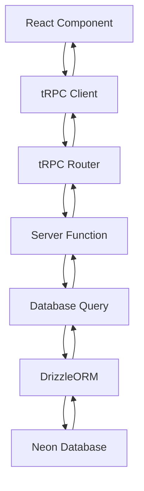
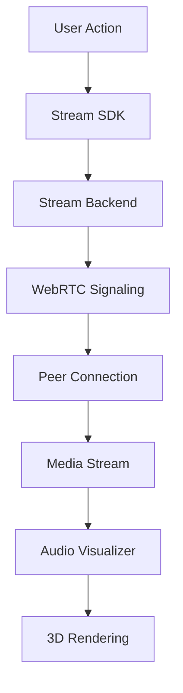
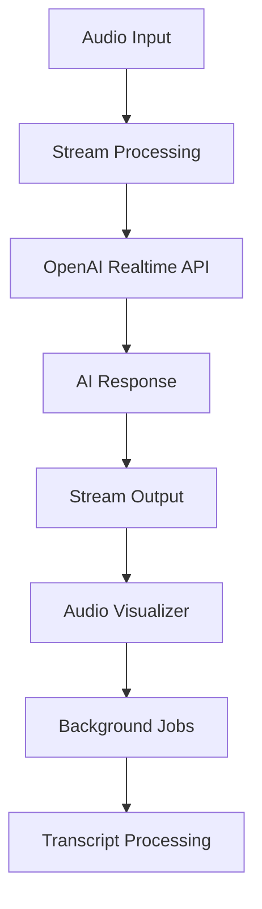

# Hello AI - Talk with and Learn from your favourite books - Architecture Documentation

## 📋 Table of Contents

1. [Overview](#overview)
2. [Architecture Principles](#architecture-principles)
3. [Technology Stack](#technology-stack)
4. [Project Structure](#project-structure)
5. [Module Architecture](#module-architecture)
6. [Data Flow](#data-flow)
7. [API Architecture](#api-architecture)
8. [Database Design](#database-design)
9. [Real-time Architecture](#real-time-architecture)
10. [Authentication & Authorization](#authentication--authorization)
11. [AI Integration](#ai-integration)
12. [Payment Processing](#payment-processing)
13. [Background Jobs](#background-jobs)
14. [Development Workflow](#development-workflow)
15. [Deployment Architecture](#deployment-architecture)
16. [Security Considerations](#security-considerations)
17. [Performance Optimization](#performance-optimization)
18. [Monitoring & Analytics](#monitoring--analytics)

---

## 🏗️ Overview

Hello AI - Talk with and Learn from your favourite books is a sophisticated AI-powered video conferencing application built with modern web technologies. The application enables real-time video calls with AI agents, automatic meeting transcription, and advanced post-call analysis features. It is designed to be scalable, maintainable, and provide a seamless user experience.

### Core Features
- 🤖 AI-powered video calls with custom agents
- 📞 Real-time video & audio communication
- 💬 Integrated chat functionality
- 📝 Automatic transcription & summaries
- 🔍 Intelligent search capabilities
- 💳 Subscription management
- 📱 Responsive design for all devices

---

## 🎯 Architecture Principles

### 1. **Modular Design**
- Feature-based module organization
- Clear separation of concerns
- Independent deployability per module
- Reusable component architecture

### 2. **Type Safety**
- End-to-end TypeScript implementation
- Compile-time error detection
- Automatic API contract validation
- Schema-driven development

### 3. **Real-time First**
- Built for real-time interactions
- Optimistic UI updates
- Low-latency communication
- Scalable WebRTC infrastructure

### 4. **Developer Experience**
- Hot reload development
- Comprehensive tooling
- Consistent patterns
- Clear documentation

---

## 🛠️ Technology Stack

### **Frontend**
```typescript
// Core Framework
Next.js 15          // React framework with App Router
React 19            // Latest React with concurrent features
TypeScript 5        // Type safety and developer experience

// Styling & UI
Tailwind CSS v4     // Utility-first CSS framework
Shadcn/ui          // Reusable component library
Radix UI           // Headless UI primitives
Lucide React       // Icon library

// State Management
TanStack Query     // Server state management
React Hook Form    // Form state management
Zustand           // Client state (when needed)
```

### **Backend**
```typescript
// API Layer
tRPC              // Type-safe API framework
Next.js API       // Server-side endpoints
Zod               // Schema validation

// Database
DrizzleORM        // Type-safe database toolkit
Neon Database     // Serverless PostgreSQL
```

### **Real-time & Communication**
```typescript
// Video & Chat
Stream Video SDK  // Video calling infrastructure
Stream Chat SDK   // Real-time messaging
WebRTC           // Peer-to-peer communication

// AI Integration
OpenAI API       // Language model integration
Stream AI        // Real-time AI processing
```

### **Infrastructure**
```typescript
// Background Processing
Inngest          // Reliable background jobs
Webhooks         // Event-driven architecture

// Authentication
Better Auth      // Modern authentication library

// Payments
Polar           // Subscription management

// Development
ESLint          // Code linting
Prettier        // Code formatting
Drizzle Kit     // Database migrations
```

---

## 📁 Project Structure

```
next15-hello-ai-main/
├── docs/                    # Documentation
├── public/                  # Static assets
├── src/
│   ├── app/                # Next.js App Router
│   │   ├── (auth)/         # Auth route group
│   │   ├── (dashboard)/    # Dashboard route group
│   │   ├── api/            # API endpoints
│   │   ├── call/           # Call pages
│   │   ├── globals.css     # Global styles
│   │   └── layout.tsx      # Root layout
│   │
│   ├── components/         # Shared UI components
│   │   ├── ui/             # Base UI components
│   │   └── ...
│   │
│   ├── lib/                # Shared utilities
│   │   ├── auth.ts         # Auth configuration
│   │   ├── stream-*.ts     # Stream SDK configs
│   │   └── utils.ts        # Common utilities
│   │
│   ├── modules/            # Feature modules
│   │   ├── agents/         # AI agent management
│   │   ├── auth/           # Authentication
│   │   ├── call/           # Video calling
│   │   ├── dashboard/      # Dashboard features
│   │   ├── home/           # Home page
│   │   ├── meetings/       # Meeting management
│   │   └── premium/        # Subscription features
│   │
│   ├── db/                 # Database layer
│   │   ├── schema.ts       # Database schema
│   │   └── index.ts        # Database connection
│   │
│   ├── trpc/               # tRPC configuration
│   │   ├── routers/        # API routers
│   │   ├── client.tsx      # Client setup
│   │   └── server.tsx      # Server setup
│   │
│   ├── inngest/            # Background jobs
│   ├── hooks/              # Shared React hooks
│   └── constants.ts        # Application constants
│
├── package.json            # Dependencies & scripts
├── drizzle.config.ts       # Database configuration
├── next.config.ts          # Next.js configuration
├── tailwind.config.js      # Tailwind configuration
└── tsconfig.json           # TypeScript configuration
```

---

## 🧩 Module Architecture

Each module follows a consistent internal structure:

```
src/modules/[feature]/
├── ui/
│   ├── components/         # Feature-specific components
│   │   ├── component-a.tsx
│   │   └── component-b.tsx
│   └── views/              # Page-level components
│       ├── feature-page.tsx
│       └── feature-modal.tsx
│
├── hooks/                  # Feature-specific hooks
│   ├── use-feature-data.ts
│   └── use-feature-actions.ts
│
├── server/                 # Server-side logic
│   ├── queries.ts          # Database queries
│   ├── mutations.ts        # Database mutations
│   └── validations.ts      # Server validations
│
├── schemas.ts              # Zod validation schemas
├── types.ts                # TypeScript definitions
├── params.ts               # URL parameter handling
└── constants.ts            # Module constants
```

### Example: Call Module
```typescript
// src/modules/call/ui/components/audio-visualizer-3d.tsx
export const AudioVisualizer3D = memo(AudioVisualizer3DComponent);

// src/modules/call/ui/views/call-view.tsx
export function CallView({ callId }: { callId: string }) {
  // Page-level component logic
}

// src/modules/call/hooks/use-call-state.ts
export function useCallState(callId: string) {
  // Call-specific state management
}

// src/modules/call/server/call-queries.ts
export async function getCallById(callId: string) {
  // Database queries for calls
}
```

---

## 🔄 Data Flow

### 1. **Client-Server Communication**


### 2. **Real-time Data Flow**


### 3. **AI Processing Flow**


---

## 🔌 API Architecture

### tRPC Router Structure
```typescript
// src/trpc/routers/_app.ts
export const appRouter = createTRPCRouter({
  auth: authRouter,
  meetings: meetingsRouter,
  agents: agentsRouter,
  premium: premiumRouter,
});

// Type inference
export type AppRouter = typeof appRouter;
```

### API Endpoints
```typescript
// Authentication
POST /api/auth/signin
POST /api/auth/signup
GET  /api/auth/session

// Meetings
GET    /api/trpc/meetings.list
POST   /api/trpc/meetings.create
PUT    /api/trpc/meetings.update
DELETE /api/trpc/meetings.delete

// Stream Integration
POST /api/webhooks/stream
GET  /api/stream/token

// AI Processing
POST /api/ai/process-transcript
GET  /api/ai/summary
```

### Request/Response Patterns
```typescript
// Standard tRPC Pattern
const meetings = api.meetings.list.useQuery({
  page: 1,
  limit: 10,
  status: 'completed'
});

// Mutation Pattern
const createMeeting = api.meetings.create.useMutation({
  onSuccess: (meeting) => {
    router.push(`/call/${meeting.id}`);
  }
});
```

---

## 🗄️ Database Design

### Schema Overview
```typescript
// src/db/schema.ts
export const users = pgTable('users', {
  id: text('id').primaryKey(),
  email: text('email').notNull().unique(),
  name: text('name'),
  image: text('image'),
  createdAt: timestamp('created_at').defaultNow(),
});

export const meetings = pgTable('meetings', {
  id: text('id').primaryKey(),
  title: text('title').notNull(),
  userId: text('user_id').references(() => users.id),
  streamCallId: text('stream_call_id'),
  status: text('status').default('scheduled'),
  startTime: timestamp('start_time'),
  endTime: timestamp('end_time'),
  transcript: jsonb('transcript'),
  summary: text('summary'),
  createdAt: timestamp('created_at').defaultNow(),
});

export const agents = pgTable('agents', {
  id: text('id').primaryKey(),
  name: text('name').notNull(),
  description: text('description'),
  prompt: text('prompt'),
  model: text('model').default('gpt-4'),
  voice: text('voice').default('alloy'),
  userId: text('user_id').references(() => users.id),
});
```

### Relationships
```typescript
// Relations
export const usersRelations = relations(users, ({ many }) => ({
  meetings: many(meetings),
  agents: many(agents),
}));

export const meetingsRelations = relations(meetings, ({ one }) => ({
  user: one(users, {
    fields: [meetings.userId],
    references: [users.id],
  }),
}));
```

---

## ⚡ Real-time Architecture

### Stream Integration
```typescript
// Video Call Setup
const client = new StreamVideoClient({
  apiKey: process.env.NEXT_PUBLIC_STREAM_API_KEY!,
  user,
  token,
});

// Call Creation
const call = client.call('default', callId);
await call.getOrCreate({
  data: {
    custom: {
      title: meeting.title,
      agent: meeting.agent,
    },
  },
});
```

### Audio Visualization Pipeline
```typescript
// Real-time Audio Processing
const audioContext = new AudioContext();
const analyser = audioContext.createAnalyser();
const mediaSource = audioContext.createMediaStreamSource(stream);

// Connect to visualizer
mediaSource.connect(analyser);
const frequencyData = new Uint8Array(analyser.frequencyBinCount);

// Update visualization
function updateVisualization() {
  analyser.getByteFrequencyData(frequencyData);
  updateThreeJSScene(frequencyData);
  requestAnimationFrame(updateVisualization);
}
```

---

## 🔐 Authentication & Authorization

### Better Auth Configuration
```typescript
// src/lib/auth.ts
export const auth = betterAuth({
  database: {
    provider: 'pg',
    url: process.env.DATABASE_URL!,
  },
  emailAndPassword: {
    enabled: true,
  },
  socialProviders: {
    google: {
      clientId: process.env.GOOGLE_CLIENT_ID!,
      clientSecret: process.env.GOOGLE_CLIENT_SECRET!,
    },
  },
});
```

### Authorization Patterns
```typescript
// Route Protection
export default async function DashboardPage() {
  const session = await auth.api.getSession({
    headers: await headers(),
  });

  if (!session) {
    redirect('/auth/signin');
  }

  return <DashboardContent user={session.user} />;
}

// API Route Protection
export async function protectedProcedure() {
  return publicProcedure.use(async ({ ctx, next }) => {
    if (!ctx.session?.user) {
      throw new TRPCError({ code: 'UNAUTHORIZED' });
    }

    return next({
      ctx: {
        ...ctx,
        user: ctx.session.user,
      },
    });
  });
}
```

---

## 🤖 AI Integration

### OpenAI Realtime API
```typescript
// AI Agent Configuration
const realtimeSession = new RealtimeSession({
  apiKey: process.env.OPENAI_API_KEY!,
  model: 'gpt-4-realtime-preview',
  voice: agent.voice,
  instructions: agent.prompt,
});

// Stream Integration
const streamAI = new StreamAI({
  session: realtimeSession,
  call: streamCall,
});
```

### AI Processing Pipeline
1. **Audio Input** → Stream captures user audio
2. **Real-time Processing** → OpenAI processes audio stream
3. **AI Response** → Generated audio response
4. **Visual Feedback** → Audio visualizer reacts
5. **Background Processing** → Transcript generation
6. **Post-processing** → Summary and insights

---

## 💳 Payment Processing

### Polar Integration
```typescript
// Subscription Management
const polar = new PolarApi({
  accessToken: process.env.POLAR_ACCESS_TOKEN!,
  server: 'production', // or 'sandbox'
});

// Subscription Flow
export async function createSubscription(userId: string, productId: string) {
  const subscription = await polar.subscriptions.create({
    productId,
    customerId: userId,
  });

  return subscription;
}
```

---

## ⚙️ Background Jobs

### Inngest Configuration
```typescript
// src/inngest/functions.ts
export const processTranscript = inngest.createFunction(
  { id: 'process-transcript' },
  { event: 'meeting/ended' },
  async ({ event, step }) => {
    // Step 1: Extract audio
    const audio = await step.run('extract-audio', () =>
      extractAudioFromCall(event.data.callId)
    );

    // Step 2: Generate transcript
    const transcript = await step.run('generate-transcript', () =>
      openai.audio.transcriptions.create({
        file: audio,
        model: 'whisper-1',
      })
    );

    // Step 3: Generate summary
    const summary = await step.run('generate-summary', () =>
      openai.chat.completions.create({
        model: 'gpt-4',
        messages: [
          {
            role: 'system',
            content: 'Summarize this meeting transcript...',
          },
          {
            role: 'user',
            content: transcript.text,
          },
        ],
      })
    );

    // Step 4: Update database
    await step.run('update-meeting', () =>
      db.update(meetings)
        .set({
          transcript: transcript.text,
          summary: summary.choices[0].message.content,
        })
        .where(eq(meetings.streamCallId, event.data.callId))
    );
  }
);
```

---

## 🚀 Development Workflow

### Environment Setup
```bash
# 1. Install dependencies
npm install --legacy-peer-deps

# 2. Setup environment variables
cp .env.example .env.local

# 3. Setup database
npm run db:push

# 4. Start development servers
npm run dev          # Next.js server (localhost:3000)
npm run dev:webhook  # Webhook server (ngrok tunnel)
npx inngest-cli@latest dev  # Inngest server (localhost:8288)
```

### Development Scripts
```json
{
  "scripts": {
    "dev": "next dev",
    "build": "next build",
    "start": "next start",
    "lint": "next lint",
    "db:push": "drizzle-kit push",
    "db:studio": "drizzle-kit studio",
    "dev:webhook": "ngrok http --url=[YOUR_DOMAIN] 3000"
  }
}
```

### Code Quality
```typescript
// ESLint Configuration
module.exports = {
  extends: ['next/core-web-vitals'],
  rules: {
    '@typescript-eslint/no-explicit-any': 'warn',
    'react/no-unescaped-entities': 'off',
  },
};

// Type Checking
"compilerOptions": {
  "strict": true,
  "noUncheckedIndexedAccess": true,
  "exactOptionalPropertyTypes": true
}
```

---

## 🏭 Deployment Architecture

### Production Environment
```yaml
# Recommended Deployment Stack
Frontend: Vercel / Netlify
Database: Neon (Serverless PostgreSQL)
Background Jobs: Inngest Cloud
File Storage: Vercel Blob / AWS S3
CDN: Vercel Edge Network
Monitoring: Vercel Analytics
```

### Environment Variables
```bash
# Database
DATABASE_URL=postgresql://...

# Authentication
AUTH_SECRET=your-secret-key
GOOGLE_CLIENT_ID=...
GOOGLE_CLIENT_SECRET=...

# Stream
NEXT_PUBLIC_STREAM_API_KEY=...
STREAM_SECRET_KEY=...

# OpenAI
OPENAI_API_KEY=...

# Polar
POLAR_ACCESS_TOKEN=...

# Inngest
INNGEST_EVENT_KEY=...
INNGEST_SIGNING_KEY=...
```

### Build Optimization
```typescript
// next.config.ts
const nextConfig = {
  experimental: {
    optimizePackageImports: ['@stream-io/video-react-sdk'],
  },
  images: {
    domains: ['avatars.githubusercontent.com'],
  },
  webpack: (config) => {
    config.externals.push({
      'utf-8-validate': 'commonjs utf-8-validate',
      'bufferutil': 'commonjs bufferutil',
    });
    return config;
  },
};
```

---

## 🔒 Security Considerations

### Authentication Security
- **Session Management**: Secure HTTP-only cookies
- **CSRF Protection**: Built-in CSRF tokens
- **Rate Limiting**: API endpoint protection
- **Input Validation**: Zod schema validation

### Data Protection
- **Database Security**: Row-level security (RLS)
- **API Security**: tRPC input validation
- **File Upload**: Secure file handling
- **Environment Secrets**: Proper secret management

### Stream Security
```typescript
// Token Generation
const token = client.generateUserToken({
  user_id: user.id,
  validity_in_seconds: 3600,
});

// Call Security
const call = client.call('default', callId);
await call.getOrCreate({
  data: {
    members: [{ user_id: user.id }],
  },
});
```

---

## ⚡ Performance Optimization

### Frontend Optimization
```typescript
// Code Splitting
const AudioVisualizer = lazy(() => 
  import('./components/audio-visualizer-3d')
);

// Image Optimization
<Image
  src={user.avatar}
  alt="Avatar"
  width={40}
  height={40}
  priority={false}
/>

// Bundle Analysis
npm run build -- --analyze
```

### Database Optimization
```typescript
// Efficient Queries
const meetings = await db.query.meetings.findMany({
  with: {
    user: {
      columns: { id: true, name: true },
    },
  },
  limit: 10,
  orderBy: desc(meetings.createdAt),
});

// Indexes
CREATE INDEX idx_meetings_user_id ON meetings(user_id);
CREATE INDEX idx_meetings_created_at ON meetings(created_at);
```

### Real-time Optimization
- **WebRTC Optimization**: Adaptive bitrate
- **Audio Processing**: Efficient FFT algorithms
- **3D Rendering**: Optimized Three.js scenes
- **Memory Management**: Proper cleanup

---

## 📊 Monitoring & Analytics

### Application Monitoring
```typescript
// Error Tracking
import { ErrorBoundary } from 'react-error-boundary';

function ErrorFallback({ error }: { error: Error }) {
  // Log to monitoring service
  console.error('Application Error:', error);
  return <div>Something went wrong!</div>;
}

// Performance Monitoring
export function reportWebVitals(metric: any) {
  // Send to analytics service
  analytics.track('Web Vital', metric);
}
```

### Business Metrics
- **User Engagement**: Call duration, frequency
- **AI Performance**: Response time, accuracy
- **Conversion Metrics**: Trial to paid conversion
- **Technical Metrics**: API response times, error rates

---

## 🎯 Best Practices

### Code Organization
1. **Feature-based modules** over technical layers
2. **Consistent naming conventions** across the codebase
3. **Type-first development** with comprehensive schemas
4. **Component composition** over inheritance

### Development Guidelines
1. **Write tests** for critical business logic
2. **Document complex algorithms** and business rules
3. **Use semantic versioning** for releases
4. **Follow Git flow** for feature development

### Performance Guidelines
1. **Lazy load** non-critical components
2. **Optimize images** and static assets
3. **Monitor bundle size** and Core Web Vitals
4. **Cache effectively** at multiple layers

---

## 🔮 Future Considerations

### Scalability
- **Microservices**: Split into domain services
- **Edge Computing**: Deploy closer to users
- **Database Sharding**: Horizontal scaling
- **CDN Integration**: Global content delivery

### Feature Expansion
- **Mobile Apps**: React Native implementation
- **Advanced AI**: Custom model training
- **Enterprise Features**: SSO, compliance
- **Analytics Dashboard**: Advanced insights

### Technology Updates
- **React 19**: Concurrent features adoption
- **Next.js**: App Router full migration
- **TypeScript**: Latest language features
- **AI Models**: GPT-5 integration readiness

---

*This architecture document is a living document that should be updated as the application evolves. For questions or clarifications, please refer to the development team.* 