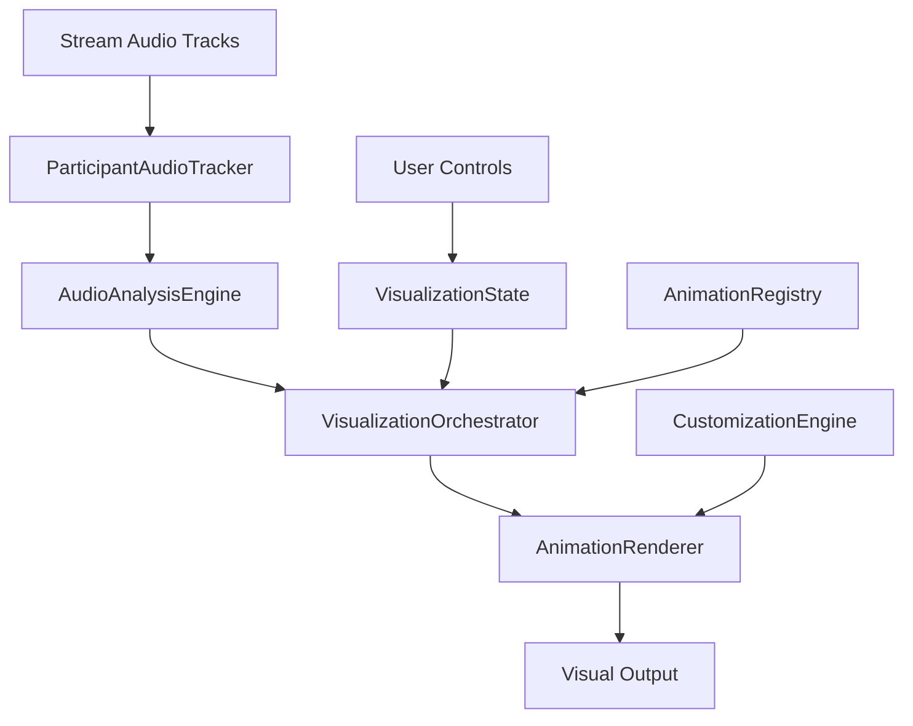

# Participant Audio Visualization System - Design Document

## 🎯 Overview

The Participant Audio Visualization System allows users to select and customize different visual effects that react to individual participant audio during video calls. Each participant can have their own unique visualization that responds to their voice patterns, creating an immersive and personalized call experience.

## 🏗️ System Architecture

### Core Components



### 1. **ParticipantAudioTracker**
Tracks and analyzes audio streams for each participant individually.

**Responsibilities:**
- Extract audio tracks from Stream participants
- Create separate AudioContext for each participant
- Provide real-time frequency analysis
- Detect speaking states and audio levels

**Interface:**
```typescript
interface ParticipantAudioData {
  participantId: string;
  participantType: 'user' | 'ai' | 'guest';
  audioLevel: number;           // Overall volume (0-1)
  frequencyData: Uint8Array;    // Raw frequency data
  frequencyBands: {             // Processed frequency bands
    low: number;    // 0-250Hz
    mid: number;    // 250-4000Hz  
    high: number;   // 4000Hz+
  };
  isSpeaking: boolean;
  peakFrequency: number;
  audioStream: MediaStream;
}
```

### 2. **VisualizationOrchestrator**
Central coordinator that manages all participant visualizations.

**Responsibilities:**
- Coordinate multiple participant visualizations
- Manage animation lifecycle
- Handle performance optimization
- Distribute audio data to appropriate renderers

**Interface:**
```typescript
interface VisualizationState {
  participants: Map<string, ParticipantVisualization>;
  activeAnimations: Set<string>;
  globalSettings: GlobalVisualizationSettings;
  performanceMode: 'high' | 'balanced' | 'low';
}

interface ParticipantVisualization {
  participantId: string;
  participantType: 'user' | 'ai' | 'guest';
  animationType: AnimationType;
  customization: AnimationCustomization;
  isActive: boolean;
  zIndex: number;  // Layer priority
  position: 'background' | 'overlay' | 'split';
}
```

### 3. **AnimationRegistry**
Registry system for all available animation types.

**Available Animations:**
1. **SpiralAnimation** - Golden ratio spiral with pulsing dots
2. **DottedBackground** - Animated dot matrix background  
3. **MetamorphicLoader** - Morphing geometric shapes
4. **GradientAnimation** - Flowing gradient effects
5. **GlowingStars** - Twinkling star field
6. **Lamps** - Illuminated lamp effects
7. **CanvasEffect** - Shader-based dot matrix

**Interface:**
```typescript
type AnimationType = 'spiral' | 'dotted' | 'metamorphic' | 'gradient' | 'stars' | 'lamps' | 'canvas';

interface AnimationComponent {
  name: string;
  displayName: string;
  description: string;
  category: 'geometric' | 'organic' | 'abstract' | 'particle';
  performance: 'low' | 'medium' | 'high';
  render: (props: AnimationProps) => React.ReactElement;
  defaultConfig: AnimationConfig;
  customizationOptions: CustomizationOption[];
}

interface AnimationProps {
  audioData: ParticipantAudioData;
  customization: AnimationCustomization;
  dimensions: { width: number; height: number };
  isActive: boolean;
  participantInfo: ParticipantInfo;
}
```

### 4. **CustomizationEngine** 
Handles user customization of animation parameters.

**Customization Categories:**
- **Colors**: Primary, secondary, accent colors
- **Intensity**: How much audio affects the animation
- **Speed**: Animation speed multiplier
- **Style**: Variant-specific options
- **Positioning**: Where animation appears

**Interface:**
```typescript
interface AnimationCustomization {
  colors: {
    primary: string;
    secondary: string;
    accent: string;
    background: string;
  };
  intensity: number;      // 0.1 - 2.0
  speed: number;          // 0.5 - 3.0
  opacity: number;        // 0.1 - 1.0
  scale: number;          // 0.5 - 2.0
  position: AnimationPosition;
  blendMode: BlendMode;
  customParams: Record<string, any>;
}

interface AnimationPosition {
  type: 'background' | 'overlay' | 'split' | 'corner';
  layer: number;
  alignment?: 'center' | 'top' | 'bottom' | 'left' | 'right';
}
```

## 🎨 Animation Specifications

### 1. SpiralAnimation
**Description:** Golden ratio spiral with audio-reactive dots
**Best for:** User speech, clear voice patterns
**Customization:**
- Dot count (100-1000)
- Dot size (1-5px)
- Spiral speed
- Color progression

**Audio Reactivity:**
- Dot size → Overall audio level
- Dot opacity → High frequencies
- Spiral rotation → Mid frequencies
- Color intensity → Low frequencies

### 2. DottedBackground
**Description:** Animated dot matrix background
**Best for:** AI responses, ambient visualization
**Customization:**
- Dot density
- Animation speed
- Vignette intensity
- Glow effects

**Audio Reactivity:**
- Dot brightness → Audio level
- Animation speed → Frequency changes
- Vignette → Speech detection
- Glow intensity → Peak frequencies

### 3. MetamorphicLoader
**Description:** Morphing geometric shapes
**Best for:** Transition states, AI thinking
**Customization:**
- Shape count (3-12)
- Morphing speed
- Color transitions
- Size progression

**Audio Reactivity:**
- Shape deformation → Audio level
- Rotation speed → High frequencies
- Color shifts → Frequency bands
- Scale changes → Volume peaks

### 4. GradientAnimation
**Description:** Flowing animated gradients
**Best for:** Ambient background, multiple participants
**Customization:**
- Gradient colors (5 colors max)
- Flow speed
- Blend modes
- Interactive mode

**Audio Reactivity:**
- Color intensity → Audio level
- Flow speed → Speech rate
- Gradient position → Frequency distribution
- Blur intensity → Audio clarity

### 5. GlowingStars
**Description:** Twinkling star field effect
**Best for:** Quiet moments, AI contemplation
**Customization:**
- Star count (50-200)
- Twinkle speed
- Glow intensity
- Constellation patterns

**Audio Reactivity:**
- Star brightness → Audio level
- Twinkle rate → High frequencies
- Glow size → Mid frequencies
- Star movement → Low frequencies

### 6. Lamps
**Description:** Illuminated lamp effects
**Best for:** Warm conversations, focused attention
**Customization:**
- Lamp color
- Beam width
- Intensity
- Background darkness

**Audio Reactivity:**
- Beam intensity → Audio level
- Beam width → Frequency spread
- Color temperature → Emotional tone
- Flicker → Speech patterns

### 7. CanvasEffect
**Description:** Shader-based dot matrix
**Best for:** Technical discussions, dynamic content
**Customization:**
- Dot size and spacing
- Animation speed
- Color palette
- Reveal patterns

**Audio Reactivity:**
- Dot opacity → Audio level
- Animation speed → Speech rate
- Color cycling → Frequency analysis
- Pattern complexity → Audio complexity

## 🎛️ User Interface Design

### Visualization Control Panel

**Location:** Floating overlay during calls, accessible via button

**Sections:**
1. **Quick Select** - Preset combinations
2. **Animation Library** - Browse all animations
3. **Customization** - Detailed settings
4. **Presets** - Save/load custom configurations
5. **Performance** - Quality settings

**Interface Layout:**
```
┌─────────────────────────────────────┐
│ 🎨 Visualization Controls           │
├─────────────────────────────────────┤
│ Quick Select:                       │
│ [Spiral] [Dotted] [Stars] [Gradient]│
├─────────────────────────────────────┤
│ My Voice: 🌟 GlowingStars           │
│ AI Voice: 🌀 SpiralAnimation        │
├─────────────────────────────────────┤
│ Customize │ Presets │ Performance   │
└─────────────────────────────────────┘
```

### Customization Interface

**Real-time Preview:** Show animation effect as user adjusts settings
**Category Tabs:** Colors, Motion, Effects, Position
**Presets:** "Energetic", "Calm", "Professional", "Creative"
**Save/Share:** Custom configurations

## 🔧 Technical Implementation

### Core Classes

```typescript
class ParticipantAudioTracker {
  private participants: Map<string, ParticipantAudio> = new Map();
  private audioContexts: Map<string, AudioContext> = new Map();
  
  trackParticipant(participantId: string, stream: MediaStream): void;
  getAudioData(participantId: string): ParticipantAudioData;
  cleanup(participantId: string): void;
}

class VisualizationOrchestrator {
  private visualizations: Map<string, ParticipantVisualization> = new Map();
  private renderer: AnimationRenderer;
  
  setParticipantVisualization(participantId: string, config: VisualizationConfig): void;
  updateAudioData(participantId: string, audioData: ParticipantAudioData): void;
  render(): void;
}

class AnimationRenderer {
  private activeAnimations: Map<string, AnimationInstance> = new Map();
  
  renderAnimation(type: AnimationType, props: AnimationProps): React.ReactElement;
  updateAnimation(participantId: string, audioData: ParticipantAudioData): void;
  cleanup(participantId: string): void;
}
```

### Performance Optimization

**Rendering Strategy:**
- Only render visualizations for active speakers
- Use requestAnimationFrame for smooth animations
- Implement LOD (Level of Detail) based on performance mode
- Canvas/WebGL optimization for complex effects

**Memory Management:**
- Cleanup audio contexts when participants leave
- Dispose of unused animation resources
- Limit concurrent complex animations

**Battery Optimization:**
- Reduce animation complexity on mobile
- Lower frame rates when call is in background
- Pause non-essential animations

## 🎯 User Experience Flow

### Initial Setup
1. User joins call
2. Default visualizations assigned (user: gradient, AI: spiral)
3. Gentle introduction tooltip appears
4. User can immediately see their voice affecting the visualization

### During Call
1. **Quick Access:** Single button to open visualization controls
2. **Live Preview:** See changes immediately as you adjust settings
3. **Smart Suggestions:** AI suggests visualizations based on conversation tone
4. **Minimal Interruption:** Controls overlay doesn't disrupt the call

### Customization Flow
1. **Browse Gallery:** Visual preview of all animations
2. **Try Before Apply:** Test with current audio
3. **Quick Customize:** Adjust key parameters with sliders
4. **Save Preset:** Save custom configuration for future calls

## 🚀 Advanced Features

### Adaptive Visualizations
- **Emotional Recognition:** Adjust colors based on speech emotion
- **Conversation Context:** Different styles for different topics
- **Time of Day:** Warmer/cooler themes based on local time
- **Participant Count:** Adjust complexity based on number of participants

### Social Features
- **Preset Sharing:** Share custom visualization presets
- **Themed Calls:** Coordinated visualizations for all participants
- **Reaction Visualizations:** Visual feedback for reactions
- **Meeting Highlights:** Save visualization moments

### Accessibility
- **Reduced Motion:** Respect user preferences
- **High Contrast:** Enhanced visibility options
- **Audio Descriptions:** Describe visual effects for screen readers
- **Keyboard Navigation:** Full keyboard control

## 📊 Performance Metrics

### Target Performance
- **Frame Rate:** 60fps for simple animations, 30fps for complex
- **CPU Usage:** <10% additional CPU usage
- **Memory:** <100MB additional memory per active visualization
- **Battery:** <5% additional battery drain on mobile

### Quality Levels
1. **High Quality:** Full effects, 60fps, all features
2. **Balanced:** Reduced particle counts, 30fps, core features
3. **Performance:** Simplified effects, 15fps, essential features only

## 🔍 Testing Strategy

### Automated Testing
- **Audio Processing:** Unit tests for frequency analysis
- **Animation Performance:** Benchmark tests for each animation
- **Memory Leaks:** Tests for proper cleanup
- **Cross-browser:** Compatibility testing

### User Testing
- **Usability:** Can users easily find and use controls?
- **Performance:** How does it affect call quality?
- **Preference:** Which animations do users prefer?
- **Accessibility:** Are all features accessible?

## 🎉 Implementation Phases

### Phase 1: Foundation (Week 1-2)
- [ ] ParticipantAudioTracker implementation
- [ ] Basic VisualizationOrchestrator
- [ ] Simple animation registry
- [ ] Basic UI controls

### Phase 2: Core Animations (Week 3-4)
- [ ] Implement all 7 animation types
- [ ] Audio-reactive behaviors
- [ ] Basic customization options
- [ ] Performance optimization

### Phase 3: User Experience (Week 5-6)
- [ ] Polished UI controls
- [ ] Preset system
- [ ] Real-time customization
- [ ] Mobile optimization

### Phase 4: Advanced Features (Week 7-8)
- [ ] Adaptive visualizations
- [ ] Social features
- [ ] Accessibility improvements
- [ ] Analytics and metrics

---

## 🎯 Success Criteria

**Technical Success:**
- ✅ Stable 30+ fps with multiple visualizations
- ✅ <100ms audio-to-visual latency
- ✅ Cross-browser compatibility
- ✅ Mobile device support

**User Success:**
- ✅ 90%+ users can customize their visualization
- ✅ <30 seconds to find preferred animation
- ✅ Positive impact on call engagement
- ✅ No negative impact on call quality

**Business Success:**
- ✅ Increased call duration
- ✅ Higher user retention
- ✅ Positive user feedback
- ✅ Differentiation from competitors

---

*This design document will be updated as we iterate on the implementation. The system is designed to be modular and extensible, allowing for easy addition of new animation types and features.* 