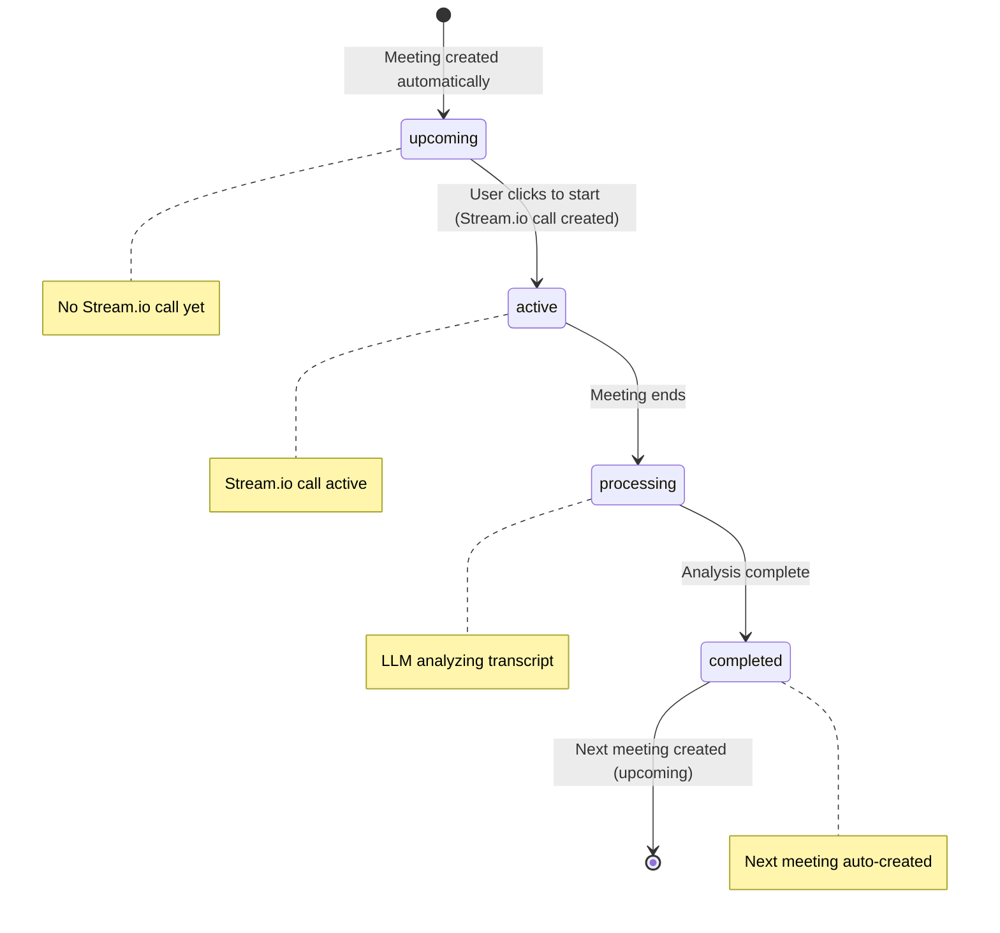

# Automatic Meeting System - Technical Design Document

## 🎯 Overview

This document provides the technical design for implementing an automated meeting progression system that simplifies user experience while maintaining flexibility. The system automatically creates the next meeting after each conversation completion, with all instructions and progress tracking generated by LLM.

**Core Philosophy: Simplicity and LLM-Powered Flexibility**

---

## 🗄️ Enhanced Database Schema

### 1. Agents Table (ENHANCED)
```typescript
export const agents = pgTable("agents", {
  id: text("id").primaryKey(),
  name: text("name").notNull(),
  userId: text("user_id").references(() => user.id),
  instructions: text("instructions"), // For legacy non-blueprint agents
  blueprintId: text("blueprint_id").references(() => agentBlueprints.id),
  
  // NEW: Blueprint snapshot (version isolation)
  blueprintSnapshot: jsonb("blueprint_snapshot"), // Snapshot at agent creation
  
  // NEW: Progress tracking (LLM-generated markdown)
  progressTracker: text("progress_tracker"), // Simple markdown format
  
  createdAt: timestamp("created_at").defaultNow(),
  updatedAt: timestamp("updated_at").defaultNow(),
});
```

### 2. Meetings Table (SIMPLIFIED)
```typescript
export const meetings = pgTable("meetings", {
  id: text("id").primaryKey(),
  name: text("name").notNull(),
  userId: text("user_id").references(() => user.id),
  agentId: text("agent_id").references(() => agents.id),
  
  // NEW: Track which conversation this meeting represents
  conversationId: text("conversation_id"), // From blueprint conversations
  
  status: meetingStatus("status").default("upcoming"),
  startedAt: timestamp("started_at"),
  endedAt: timestamp("ended_at"),
  transcriptUrl: text("transcript_url"),
  recordingUrl: text("recording_url"),
  summary: text("summary"),
  meetingInstructions: text("meeting_instructions"), // Pre-computed or LLM-generated
  
  // REMOVED: meetingData field - no longer needed
  
  createdAt: timestamp("created_at").defaultNow(),
  updatedAt: timestamp("updated_at").defaultNow(),
});
```

### 3. Agent Blueprints Table (UNCHANGED)
```typescript
export const agentBlueprints = pgTable("agent_blueprints", {
  id: text("id").primaryKey(),
  name: text("name").notNull(),
  description: text("description"),
  marketingCollateral: jsonb("marketing_collateral").notNull(),
  meetingTemplates: jsonb("meeting_templates").notNull(), // Conversation definitions
  type: text("type", { enum: ["sequential", "recurring"] }).default("sequential"),
  isActive: boolean("is_active").default(true),
  createdAt: timestamp("created_at").defaultNow(),
  updatedAt: timestamp("updated_at").defaultNow(),
});
```

---

## 📊 JSON Schema Definitions

### 1. Blueprint Snapshot (Simple Structure)
```typescript
interface BlueprintSnapshot {
  id: string;
  name: string;
  description: string;
  marketingCollateral: any;
  conversations: ConversationDefinition[];
}

interface ConversationDefinition {
  id: string;
  name: string;
  status: "pending" | "in-progress" | "completed";
  completionNotes: string;
  instructions: string;
  completionCriteria: string;
}
```

### 2. Progress Tracker (LLM-Generated Markdown)
```typescript
// Simple text field containing markdown
// Structure and content completely flexible - managed by LLM
// Example format:
`
# Think and Grow Rich Journey

## Progress Summary
- Started: January 15, 2024
- Current Conversation: Conversation 2 - Faith
- Progress: 2 of 8 conversations completed (25%)

## Key Insights
- Demonstrated strong understanding of desire principles
- Committed to daily visualization practice
- Identified clear definite chief aim: "Build a sustainable coaching business"

## Conversation History
### Conversation 1: Desire ✓
- Completed: January 15, 2024
- Outcome: Successfully identified and committed to definite chief aim
- Key takeaway: Clarity on business vision

### Conversation 2: Faith (Current)
- Status: Ready to begin
- Focus: Building belief in achievement of definite chief aim
- Preparation: Review desire statement daily

## Next Steps
- Begin faith conversation focusing on visualization techniques
- Continue daily desire statement practice
- Prepare examples of past successes for confidence building
`
```

---

## 🔄 System Flow Architecture

### 1. Blueprint Selection & Agent Creation
```typescript
// User Flow: Browse blueprints → Select → Create agent + first meeting
async function createAgentFromBlueprint(blueprintId: string, userId: string) {
  const blueprint = await fetchBlueprint(blueprintId);
  const firstConversation = blueprint.meetingTemplates.sessions[0];
  
  // Create agent with blueprint snapshot
  const agent = await db.insert(agents).values({
    name: `${blueprint.name} Journey`,
    userId,
    blueprintId,
    blueprintSnapshot: {
      id: blueprint.id,
      name: blueprint.name,
      description: blueprint.description,
      marketingCollateral: blueprint.marketingCollateral,
      conversations: blueprint.meetingTemplates.sessions
    },
    progressTracker: generateInitialProgressTracker(blueprint)
  });
  
  // Create first meeting (NO Stream.io call yet)
  const meeting = await db.insert(meetings).values({
    name: firstConversation.name,
    userId,
    agentId: agent.id,
    conversationId: firstConversation.id,
    meetingInstructions: firstConversation.instructions,
    status: "upcoming"
  });
  
  return { agent, meeting };
}
```

### 2. Meeting Start (Create Stream.io Call)
```typescript
// User Flow: Click meeting → Create call → Start conversation
async function startMeeting(meetingId: string) {
  const meeting = await fetchMeeting(meetingId);
  
  // NOW create Stream.io call
  const call = await createStreamCall(meeting);
  
  await db.update(meetings).set({
    status: "active",
    startedAt: new Date()
  }).where(eq(meetings.id, meetingId));
  
  return { meeting, call };
}
```

### 3. Meeting Completion & Automatic Progression
```typescript
// Triggered by Inngest after meeting ends
async function processMeetingCompletion(meetingId: string) {
  const meeting = await fetchMeetingWithAgent(meetingId);
  const transcript = await fetchTranscript(meeting.transcriptUrl);
  
  // LLM analyzes everything and generates next steps
  const analysis = await generateMeetingAnalysis({
    transcript,
    conversationId: meeting.conversationId,
    blueprintSnapshot: meeting.agent.blueprintSnapshot,
    currentProgressTracker: meeting.agent.progressTracker
  });
  
  // Update current meeting
  await db.update(meetings).set({
    summary: analysis.meetingSummary,
    status: "completed"
  }).where(eq(meetings.id, meetingId));
  
  // Update agent progress (LLM-generated markdown)
  await db.update(agents).set({
    progressTracker: analysis.updatedProgressTracker
  }).where(eq(agents.id, meeting.agentId));
    
  // Automatically create next meeting if journey continues
  if (analysis.nextConversation) {
    await db.insert(meetings).values({
      name: analysis.nextConversation.name,
      userId: meeting.userId,
      agentId: meeting.agentId,
      conversationId: analysis.nextConversation.id,
      meetingInstructions: analysis.nextConversation.instructions,
      status: "upcoming"
      // NOTE: No Stream.io call created - only when user clicks to start
    });
  }
}

// CRITICAL: LLM-Powered Analysis Function
async function generateMeetingAnalysis(input: {
  transcript: string;
  conversationId: string;
  blueprintSnapshot: BlueprintSnapshot;
  currentProgressTracker: string;
}) {
  // This LLM call will generate:
  // 1. Meeting summary
  // 2. Updated progress tracker (markdown)
  // 3. Next conversation determination (dynamic, not fixed)
  // 4. Next meeting instructions (customized for user)
  
  const prompt = `
    Based on this conversation transcript and user progress:
    
    TRANSCRIPT: ${input.transcript}
    CURRENT CONVERSATION: ${input.conversationId}
    BLUEPRINT: ${JSON.stringify(input.blueprintSnapshot)}
    CURRENT PROGRESS: ${input.currentProgressTracker}
    
    Generate:
    1. Meeting summary (2-3 sentences)
    2. Updated progress tracker (markdown format)
    3. Next conversation (id, name, instructions) - you decide what's best
    4. Whether to continue, repeat, skip, or end journey
    
    IMPORTANT: You have full flexibility to determine the next conversation.
    You can:
    - Move to next conversation in blueprint
    - Repeat current conversation if objectives not met
    - Skip conversations if user demonstrates mastery
    - Create custom variations
    - End journey if appropriate
  `;
  
  const response = await llm.generate(prompt);
  
  return {
    meetingSummary: response.summary,
    updatedProgressTracker: response.progressTracker, // Markdown format
    nextConversation: response.nextConversation // May be null if journey complete
  };
}
```

---

## 🔀 Meeting Status Transitions



---

## 🛠️ Implementation Plan

### Phase 1: Database Schema Updates (Week 1)
1. **Add conversationId to meetings table**
   ```sql
   ALTER TABLE meetings ADD COLUMN conversation_id TEXT;
   ```

2. **Add progress tracking to agents table**
   ```sql
   ALTER TABLE agents ADD COLUMN blueprint_snapshot JSONB;
   ALTER TABLE agents ADD COLUMN progress_tracker TEXT;
   ```

3. **Migration script for existing data**
```typescript
   // Convert existing agents to new schema
   // Set progressTracker to simple markdown
   ```

### Phase 2: Core Logic Implementation (Week 2)
1. **Enhance meeting completion processing**
   - Integrate LLM analysis function
   - Generate progress tracker updates
   - Determine next conversation dynamically

2. **Implement automatic meeting creation**
   - Create next meeting in "upcoming" status
   - No Stream.io call creation until user starts

3. **Update agent creation flow**
   - Create blueprint snapshot
   - Initialize progress tracker
   - Create first meeting

### Phase 3: LLM Integration (Week 3)
1. **Design LLM prompts for meeting analysis**
   - Meeting summary generation
   - Progress tracker updates (markdown)
   - Next conversation determination

2. **Implement flexible conversation flow**
   - Support for repeating conversations
   - Skipping conversations based on mastery
   - Custom conversation variations

3. **Add progress tracking visualization**
   - Parse markdown progress tracker
   - Display journey progress
   - Show conversation history

### Phase 4: User Interface Updates (Week 4)
1. **Blueprint browsing interface**
   - Browse available blueprints
   - "Start Journey" button
   - Agent creation flow

2. **Meeting dashboard updates**
   - Show conversation journey
   - Progress visualization
   - Meeting history with context

3. **Stream.io call management**
   - Delay call creation until meeting start
   - Optimize call lifecycle

---

## 🔍 Key Technical Decisions

### 1. LLM-Powered Next Conversation
**Decision**: LLM determines next conversation dynamically rather than fixed blueprint sequence.

**Rationale**: 
- Maximum flexibility for user progress
- Can adapt to user needs in real-time
- Supports repeating, skipping, or customizing conversations
- Maintains conversational AI principles

**Note**: This is a critical design decision that enables true adaptive learning.

### 2. Markdown Progress Tracker
**Decision**: Use simple markdown text field for progress tracking.

**Rationale**:
- Maximum flexibility for LLM to structure content
- Human-readable format
- Easy to display in UI
- No rigid schema constraints

### 3. Delayed Stream.io Call Creation
**Decision**: Create Stream.io calls only when user starts meeting.

**Rationale**:
- Reduces API calls and costs
- Prevents stale call objects
- Cleaner meeting lifecycle
- Better resource management

### 4. Blueprint Snapshot Isolation
**Decision**: Store complete blueprint snapshot in agent.

**Rationale**:
- User journey remains consistent
- Immune to blueprint changes
- Enables A/B testing of blueprints
- Clear versioning

---

## 🚀 Performance Considerations

### 1. LLM Response Time
- **Challenge**: LLM analysis may take 30-60 seconds
- **Solution**: Asynchronous processing with Inngest
- **UX**: Meeting marked "processing" with progress indicator

### 2. Database Optimization
- **Index on conversationId**: Fast lookup of meetings by conversation
- **Index on blueprintId**: Efficient agent queries
- **Progress tracker pagination**: For long journeys

### 3. Memory Usage
- **Blueprint snapshots**: Store only essential data
- **Progress tracker**: Reasonable markdown length limits
- **Cleanup**: Archive completed journeys

---

## 🔒 Business Logic Validation

### 1. Conversation Flow Rules
```typescript
// Validation rules for LLM-generated next conversations
function validateNextConversation(
  nextConversation: NextConversation,
  blueprintSnapshot: BlueprintSnapshot,
  currentProgress: string
): boolean {
  // Ensure conversationId exists in blueprint
  const validConversationIds = blueprintSnapshot.conversations.map(c => c.id);
  if (!validConversationIds.includes(nextConversation.id)) {
    return false;
}

  // Other business rules...
  return true;
}
```

### 2. Progress Tracking Integrity
```typescript
// Ensure progress tracker remains consistent
function validateProgressTracker(
  progressTracker: string,
  blueprintSnapshot: BlueprintSnapshot
): boolean {
  // Parse markdown and validate structure
  // Ensure progress percentages are logical
  // Validate conversation references
  return true;
}
```

### 3. Meeting Status Transitions
```typescript
// Enforce valid status transitions
const validTransitions = {
  upcoming: ["active", "cancelled"],
  active: ["processing"],
  processing: ["completed"],
  completed: [], // Terminal state
  cancelled: [] // Terminal state
};
```

---

## 📝 Summary

This design provides a simplified, LLM-powered approach to automatic meeting progression:

**Key Features:**
- **Automatic Next Meeting Creation**: System creates next meeting after completion
- **LLM-Powered Analysis**: Flexible conversation flow and progress tracking
- **Simplified Schema**: Removed complex meetingData, added conversationId
- **Delayed Call Creation**: Stream.io calls only created when user starts meeting
- **Blueprint Snapshots**: Version isolation for consistent user journeys
- **Markdown Progress Tracking**: Flexible, human-readable format

**Implementation Priority:**
1. Database schema updates (simple additions)
2. LLM integration for meeting analysis
3. Automatic meeting creation logic
4. User interface updates

This approach maintains simplicity while enabling powerful, adaptive conversational experiences powered by LLM intelligence.

---

*This technical design document serves as the implementation blueprint for the Automatic Meeting System.*