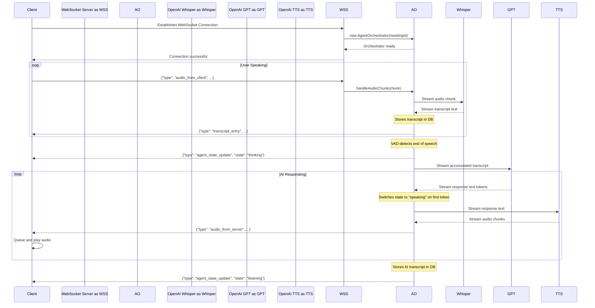

### **Design Document: Direct OpenAI Real-time Agent Architecture**

**Version:** 1.0
**Date:** July 29, 2025
**Author:** AI Architect

**1.0 Overview**

This document details the technical design for migrating the real-time voice agent from a GetStream-based architecture to a direct implementation using OpenAI APIs. The core of this design is a new WebSocket-based communication layer managed by our Next.js backend, which will orchestrate the real-time flow of audio and data between the client and OpenAI's services.

**1.1 High-Level Architecture Diagram**

```mermaid
graph TD
    subgraph Client (Browser)
        A[React UI Components] --> B(useRealtimeAgent Hook);
        B -- Captures Mic Audio --> C{Web Audio API};
        C -- Encoded Audio --> D[WebSocket Client];
        D -- Receives AI Audio --> E{Audio Playback Queue};
        E -- Plays Audio --> F[Speakers];
    end

    subgraph Backend (Next.js Server)
        G[WebSocket Server] -- Manages Connections --> H{Meeting Orchestrator Map};
        H -- For each call --> I(AgentOrchestrator);
        I -- Manages --> J(STT -> LLM -> TTS Pipeline);
    end

    subgraph OpenAI APIs
        K[Whisper API];
        L[GPT-4o API];
        M[TTS API];
    end

    D -- Audio Chunks --> G;
    G -- AI Audio Chunks --> D;

    J -- Streams Audio --> K;
    K -- Returns Transcripts --> J;
    J -- Streams Transcripts --> L;
    L -- Streams Response Text --> J;
    J -- Streams Text --> M;
    M -- Streams Audio --> J;
```

**2.0 Backend Component Design**

The backend will host a new stateful, real-time engine.

**2.1. WebSocket Server (`/api/realtime-agent`)**

*   **Technology**: A WebSocket server will be implemented using the `ws` library, running alongside the Next.js API routes.
*   **Connection Management**:
    *   It will maintain an in-memory `Map<string, AgentOrchestrator>` to associate active WebSocket connections with their corresponding `AgentOrchestrator` instances. The meeting ID will serve as the key.
    *   On a new connection, it will authenticate the request (e.g., via a JWT passed in the query params) and instantiate a new `AgentOrchestrator`, adding it to the map.
    *   On connection close, it will call the `orchestrator.cleanup()` method and remove the instance from the map to prevent memory leaks.
*   **Routing**: The server's primary role is to act as a message router, passing all incoming messages for a given connection to the `handleMessage` method of its corresponding `AgentOrchestrator`.

**2.2. Agent Orchestrator (`AgentOrchestrator.ts`)**

*   **Pattern**: A `class` that manages the lifecycle and pipeline of a single voice session.
*   **Properties**:
    *   `meetingId: string`: The ID of the meeting.
    *   `state: 'idle' | 'listening' | 'thinking' | 'speaking'`: The current state of the AI agent.
    *   `userTranscriptBuffer: string`: Accumulates the user's speech.
    *   `openai: OpenAIClient`: An instance of the OpenAI client.
    *   `webSocket: WebSocket`: The reference to the client's WebSocket connection.
*   **Core Methods**:
    *   `constructor(meetingId, ws)`: Initializes properties, retrieves the meeting `prompt` from the database.
    *   `handleAudioChunk(chunk: Buffer)`: Receives raw audio data from the client, forwards it to the Whisper stream, and performs VAD.
    *   `startPipeline()`: Establishes streaming connections to OpenAI APIs.
    *   `runVAD()`: Analyzes incoming audio volume to detect the end of a user's speech. When silence is detected, it pushes the `userTranscriptBuffer` to the LLM and clears the buffer.
    *   `sendMessageToClient(message: object)`: A wrapper to send structured JSON messages back to the client.
    *   `cleanup()`: Terminates all open streams and connections to OpenAI to ensure graceful shutdown.

**2.3. Real-time Pipeline Logic**

The orchestrator will manage a full-duplex, multi-stage pipeline:

1.  **User STT**: An ongoing stream to Whisper is maintained. As the user speaks, audio chunks are sent. Whisper responds with text chunks, which are appended to `userTranscriptBuffer`. The `transcriptCollector` is updated with this text.
2.  **Turn Detection**: The VAD logic runs in parallel. Upon detecting a sufficient pause from the user, the orchestrator sends a `state: 'thinking'` message to the client and initiates the next stage.
3.  **LLM Response**: The complete `userTranscriptBuffer` is sent to the GPT-4o Chat Completions API with `stream: true`.
4.  **AI TTS**: As text tokens arrive from the LLM, they are immediately streamed to the TTS API. This is a critical low-latency step; we do not wait for the full sentence. Before the first chunk is sent, the state is changed to `speaking`.
5.  **Audio Egress**: The audio chunks received from the TTS API are immediately forwarded to the client over the WebSocket. The AI's full response is also sent to the `transcriptCollector`.
6.  Once the TTS stream ends, the state is returned to `listening`.

**3.0 Frontend Component Design**

The frontend will replace the GetStream SDK with a custom hook managing the new WebSocket connection.

**3.1. `useRealtimeAgent` Hook (`hooks/use-realtime-agent.ts`)**

*   **Public Interface**:
    *   **State**: `isConnected: boolean`, `agentState: string`, `transcriptHistory: TranscriptEntry[]`.
    *   **Functions**: `connect(meetingId)`, `disconnect()`.
*   **Internal Logic**:
    *   **WebSocket Management**: `useEffect` to establish the connection on `connect()` and close it on `disconnect()` or unmount.
    *   **Audio Capture**: Use `MediaRecorder` to capture microphone audio in slices (e.g., every 100ms). These slices are encoded (Base64) and sent via the WebSocket.
    *   **Audio Playback**: Manages an `AudioBufferQueue`. When AI audio chunks arrive, they are decoded and pushed into the queue. A separate `AudioContext` process reads from this queue to ensure continuous, non-choppy playback.
    *   **Message Handling**: An `onmessage` handler parses incoming JSON from the server, updating state variables (`agentState`, `transcriptHistory`) accordingly.

**3.2. Component Adaptation**

*   **`CallConnect`**: Logic is simplified. It will call `connect(meetingId)` from the `useRealtimeAgent` hook. The loading spinner will be tied to the `isConnected` state from the hook.
*   **`CallUI`**: The `handleJoin` function now simply calls `connect()`. The conditional rendering (`lobby`, `call`, `processing`) remains unchanged.
*   **`CallActive`**: Will be fully driven by the `useRealtimeAgent` hook.
    *   `useCallStateHooks` is removed.
    *   The `AudioVisualization` component's `userStream` will be the local `MediaStream`. The `aiStream` will be a synthetic stream created from the `AudioBufferQueue` that plays back the AI's voice.
    *   Buttons for mute/unmute will call functions exposed by the hook.

**4.0 WebSocket API Specification**

**4.1. Client-to-Server**

```json
// For sending audio data
{
  "type": "audio_from_client",
  "payload": {
    "data": "[Base64-encoded audio chunk]"
  }
}
```

**4.2. Server-to-Client**

```json
// For sending AI-generated audio
{
  "type": "audio_from_server",
  "payload": {
    "data": "[Base64-encoded audio chunk]"
  }
}

// For sending a finalized line of transcript
{
  "type": "transcript_entry",
  "payload": {
    "id": "...",
    "speaker": "user" | "assistant",
    "text": "...",
    "timestamp": 1677654321000
  }
}

// For updating the UI with the agent's current state
{
  "type": "agent_state_update",
  "payload": {
    "state": "listening" | "thinking" | "speaking"
  }
}
```

**5.0 End-to-End Sequence Diagram**



**6.0 Migration and Deployment Strategy**

1.  **Phase 1: Backend Development**. Implement the WebSocket server and the `AgentOrchestrator` class. Create a test script (using Node.js `ws` client) to validate the entire real-time pipeline without the frontend.
2.  **Phase 2: Frontend Development**. Implement the `useRealtimeAgent` hook and adapt the UI components in a separate branch.
3.  **Phase 3: Integration & Testing**. Connect the refactored frontend to the new backend endpoint. Use a **feature flag** in the application to control whether a user gets the GetStream version or the new Direct OpenAI version.
4.  **Phase 4: Rollout**. Gradually roll out the new implementation to a percentage of users, monitoring performance and stability.
5.  **Phase 5: Deprecation**. Once the new system is fully validated, remove the feature flag and delete all legacy GetStream-related code, webhooks, and API routes.